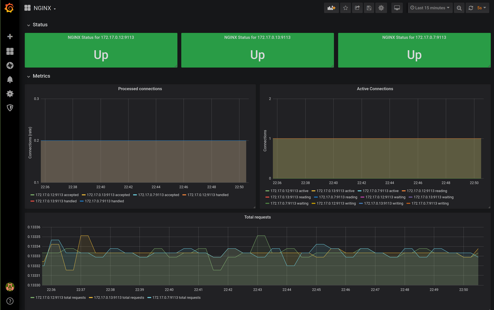

<!-- EX должны нумероваться так, как они идут в ЛК otus -->

# EX-10 Monitoring the cluster components and the applications

* [EX-10 Monitoring the cluster components and the applications](#ex-10-%d0%9c%d0%be%d0%bd%d0%b8%d1%82%d0%be%d1%80%d0%b8%d0%bd%d0%b3-%d0%ba%d0%be%d0%bc%d0%bf%d0%be%d0%bd%d0%b5%d0%bd%d1%82%d0%be%d0%b2-%d0%ba%d0%bb%d0%b0%d1%81%d1%82%d0%b5%d1%80%d0%b0-%d0%b8-%d0%bf%d1%80%d0%b8%d0%bb%d0%be%d0%b6%d0%b5%d0%bd%d0%b8%d0%b9-%d1%80%d0%b0%d0%b1%d0%be%d1%82%d0%b0%d1%8e%d1%89%d0%b8%d1%85-%d0%b2-%d0%bd%d0%b5%d0%bc)
  * [EX-10.1 What was done](#ex-101-%d0%a7%d1%82%d0%be-%d0%b1%d1%8b%d0%bb%d0%be-%d1%81%d0%b4%d0%b5%d0%bb%d0%b0%d0%bd%d0%be)
  * [EX-10.2 How to start the project](#ex-102-%d0%9a%d0%b0%d0%ba-%d0%b7%d0%b0%d0%bf%d1%83%d1%81%d1%82%d0%b8%d1%82%d1%8c-%d0%bf%d1%80%d0%be%d0%b5%d0%ba%d1%82)
  * [EX-10.3 How to check the project](#ex-103-%d0%9a%d0%b0%d0%ba-%d0%bf%d1%80%d0%be%d0%b2%d0%b5%d1%80%d0%b8%d1%82%d1%8c-%d0%bf%d1%80%d0%be%d0%b5%d0%ba%d1%82)
  * [EX-10.4 How to use the project](#ex-104-%d0%9a%d0%b0%d0%ba-%d0%bd%d0%b0%d1%87%d0%b0%d1%82%d1%8c-%d0%bf%d0%be%d0%bb%d1%8c%d0%b7%d0%be%d0%b2%d0%b0%d1%82%d1%8c%d1%81%d1%8f-%d0%bf%d1%80%d0%be%d0%b5%d0%ba%d1%82%d0%be%d0%bc)

## EX-10.1 What was done

* Main task 1: create a nginx deployment, setup a nginx metrics endpoint (`stub_status`) and setup a nginx prometheus exporter sidecar-container
* Main task 2: create a service to access to this deployment
* Main task 3: deploy a prometheus operator (by helm3)
* Main task 4: add the nginx prometheus exporter dashboards to a grafana

## EX-10.2 How to start the project

* Build and push a docker image with enabled monitoring:

  ```bash
  cd kubernetes-monitoring/docker/
  docker build -t loktionovam/web:1.17.1-alpine-2 .
  docker push loktionovam/web:1.17.1-alpine-2
  ```

* Create a nginx deployment and a nginx service and a sidecar container will expose the metrics on `http://nginx-svc:9113/metrics`

  ```bash
  cd kubernetes-monitoring
  kubectl apply -f nginx-deployment.yaml --validate=true
  kubectl apply -f nginx-svc.yaml --validate=true
  ```

* Install the prometheus-operator

  ```bash
  kubectl apply -f monitoring-ns.yaml
  helm upgrade --install prometheus-operator stable/prometheus-operator --namespace=monitoring --values=values.yaml
  ```

* Add a nginx dashboard to the grafana (in the `grafana-nginx-dashboard.yaml` there is a mark `grafana_dashboard: "1"` and the sidecar container `grafana-sc-dashboard` uses it to autoupdate the dashboards from configmap in the grafana)

  ```bash
  kubectl apply -f grafana-nginx-dashboard.yaml
  ```

## EX-10.3 How to check the project

* Port forward the grafana service to the local host:

  ```bash
  kubectl port-forward svc/prometheus-operator-grafana 3000:80 -n monitoring
  ```

* Find the nginx exporter dashboard in <http://localhost:3000> and ensure that metrics are collected from all three containers:

  

## EX-10.4 How to use the project
