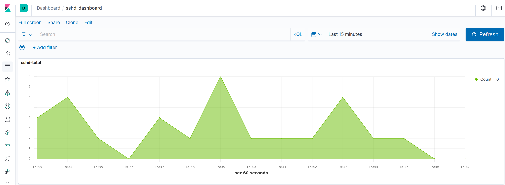
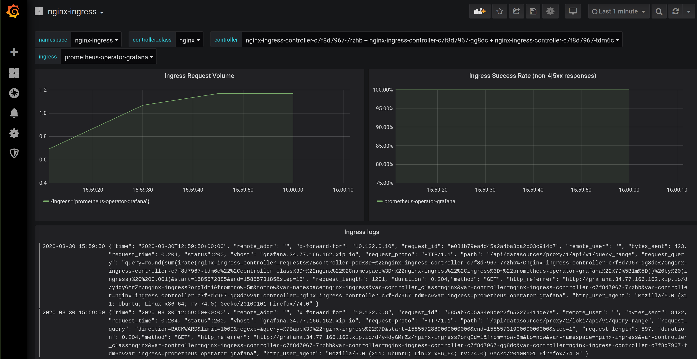

<!-- EX должны нумероваться так, как они идут в ЛК otus -->

# EX-11 Centralized Logging

* [EX-11 Centralized Logging](#ex-11-%d0%9d%d0%b0%d0%b7%d0%b2%d0%b0%d0%bd%d0%b8%d0%b5-%d0%b4%d0%be%d0%bc%d0%b0%d1%88%d0%bd%d0%b5%d0%b9-%d1%80%d0%b0%d0%b1%d0%be%d1%82%d1%8b)
  * [EX-11.1 What was done](#ex-111-%d0%a7%d1%82%d0%be-%d0%b1%d1%8b%d0%bb%d0%be-%d1%81%d0%b4%d0%b5%d0%bb%d0%b0%d0%bd%d0%be)
  * [EX-11.2 How to start the project](#ex-112-%d0%9a%d0%b0%d0%ba-%d0%b7%d0%b0%d0%bf%d1%83%d1%81%d1%82%d0%b8%d1%82%d1%8c-%d0%bf%d1%80%d0%be%d0%b5%d0%ba%d1%82)
  * [EX-11.3 How to check the project](#ex-113-%d0%9a%d0%b0%d0%ba-%d0%bf%d1%80%d0%be%d0%b2%d0%b5%d1%80%d0%b8%d1%82%d1%8c-%d0%bf%d1%80%d0%be%d0%b5%d0%ba%d1%82)
  * [EX-11.4 How to use the project](#ex-114-%d0%9a%d0%b0%d0%ba-%d0%bd%d0%b0%d1%87%d0%b0%d1%82%d1%8c-%d0%bf%d0%be%d0%bb%d1%8c%d0%b7%d0%be%d0%b2%d0%b0%d1%82%d1%8c%d1%81%d1%8f-%d0%bf%d1%80%d0%be%d0%b5%d0%ba%d1%82%d0%be%d0%bc)

## EX-11.1 What was done

* [x] Main task 1: deployed GKE infra pool (3 nodes), default pool (1 node), fixed the terraform configuration
* [x] Main task 2: installed EFK for logs collection and visualization
* [x] Main task 3: installed prometheus operator (promethues, grafana, alertmanager) to monitor an elasticsearch
* [x] Main task 4: installed elasticsearch exporter, configured an alert `ElasticsearchTooFewNodesRunning`, added an elasticsearch dashboard to grafana
* [x] Main task 5: nginx logs collecting and visualizing (nginx-total, nginx-2xx, nginx-3xx, nginx-4xx, nginx-5xx), a nginx logs dashboard in kibana
* [x] Main task 6: nginx logs collecting and visualizing via loki, logs visualizing in the grafana
* [x] Advanced task 1 (*): k8s VMs logs collecting via `systemd input plugin`. Visualizing `sshd` logs
* [x] Advanced task 2 (*): deploy a self-hosted cluster and setup collecting audits logs

## EX-11.2 How to start the project

* Deploy the infra pool и the default pool into GKE

  ```bash
  cd infra/kubernetes/terraform
  terraform init
  terraform import google_storage_bucket.storage-bucket kubernetes-tf-state-bucket-20190202001
  terraform apply
  cd gke
  terraform apply
  ```

* Setup kubectl to access to the newly created cluster:

  ```bash
  gcloud beta container clusters get-credentials primary --zone europe-west1-b
  ```

* Setup `taints` for infra nodes

  ```bash
  kubectl get nodes
  kubectl taint nodes <infra node here> node-role=infra:NoSchedule
  ```

* Install the helm charts

  ```yaml
  cd kubernetes-logging/
  kubectl create ns observability
  kubectl label nodes <nodes here> cloud.google.com/gke-nodepool=infra-pool
  helm repo add elastic https://helm.elastic.co
  helm repo update
  helm upgrade --install elasticsearch elastic/elasticsearch --wait --namespace observability -f elasticsearch.values.yaml
  helm upgrade --install nginx-ingress stable/nginx-ingress --wait --namespace=nginx-ingress -f nginx-ingress.values.yaml
  helm upgrade --install kibana elastic/kibana --wait --namespace observability -f kibana.values.yaml
  helm upgrade --install fluent-bit stable/fluent-bit --wait --namespace observability -n observability -f fluent-bit.values.yaml
  helm upgrade --install prometheus-operator stable/prometheus-operator --namespace=observability --values=prometheus.values.yaml
  helm upgrade --install elasticsearch-exporter stable/elasticsearch-exporter --wait --namespace=observability --values=elasticsearch-exporter.values.yaml

  kubectl get secrets -n observability prometheus-operator-grafana  -o jsonpath="{.data.admin-password}" | base64 -d

  helm repo add loki https://grafana.github.io/loki/charts
  helm repo update
  helm upgrade --install loki loki/loki-stack --wait --namespace=observability --values=loki.values.yaml
  ```

There is a problem [Add datasource by configuration to Grafana does not work](https://github.com/coreos/prometheus-operator/issues/1909) and because of that the `datasource` are not updated by grafana-sc-datasources sidecar container. The simplest solution is to remove a grafana pod, the sidecar container will be recreated too and the loki will be added to a datasource list:

```bash
kubectl delete pods prometheus-operator-grafana-7454c9d578-prqzk
```

* To collect the audit logs you have to bootstrap a cluster:

  ```bash
  misc/scripts/create_rancher_cluster.sh
  ```

  apply the configuration `kubernetes-logging/audit/rancher/k8s-logging.yaml` to enable the audit logs and install the elasticsearch and fluent-bit:

  ```bash
  cd kubernetes-logging/audit
  kubectl create ns observability
  helm upgrade --install elasticsearch elastic/elasticsearch --wait --namespace observability -f elasticsearch.values.yaml
  helm upgrade --install fluent-bit stable/fluent-bit --wait --namespace observability -n observability -f fluent-bit.values.yaml
  helm upgrade --install kibana elastic/kibana --wait --namespace observability -f kibana.values.yaml
  ```

  Then import `kubernetes-logging/audit/export.ndjson` dashboard into the kibana which shows how many `create` and `update` events per minute in the cluster.

## EX-11.3 How to check the project

* Here <http://kibana.34.77.166.162.xip.io> there are dashboards to display sshd and nginx ingress requests
  
* Here <http://grafana.34.77.166.162.xip.io> nginx ingress controller logs and metrics are shown
  

## EX-11.4 How to use the project
